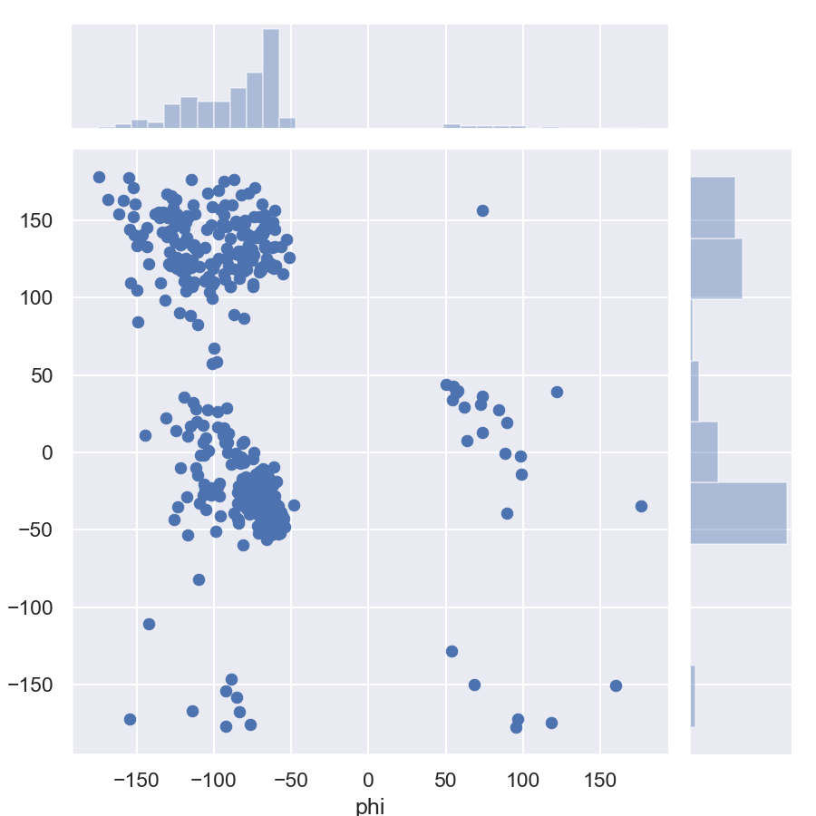

A solution for [mountain car problem](https://gym.openai.com/envs/MountainCar-v0/) via Q-learning with algorithmic and deep approaches.

## Contents
* [Requirements](#requirements)
* [How to run](#how-to-run)
* [Results](#results)

## Requirements
* **biopython** ([instructions](https://biopython.org/wiki/Download))
* **NumPy** ([instructions](http://www.scipy.org/install.html))
* **seaborn** ([instructions](https://seaborn.pydata.org/installing.html))

## How to run
* Clone this repo to your local computer
* Install all required dependencies
* ???
* Type in console `python ramachandran_plot.py`
* You're good now

## Results
Results:

*4CIW:*

*4CS4:*

*4D2I:*

